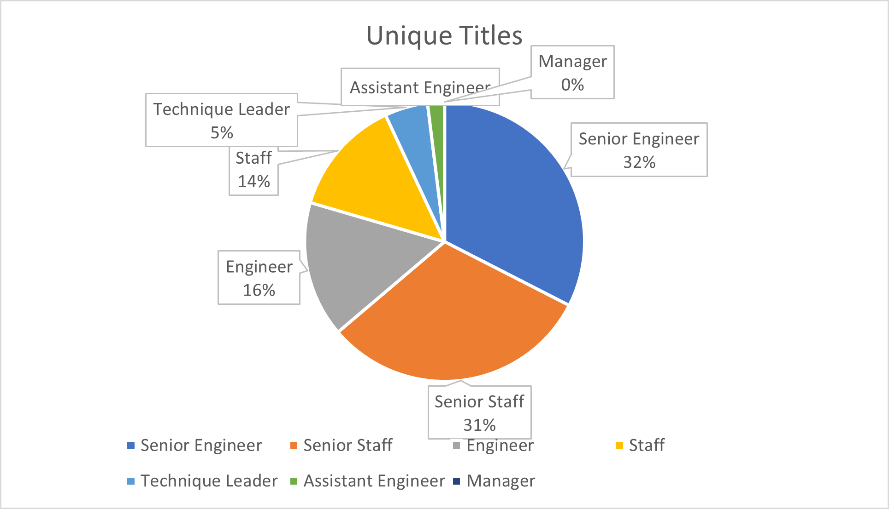
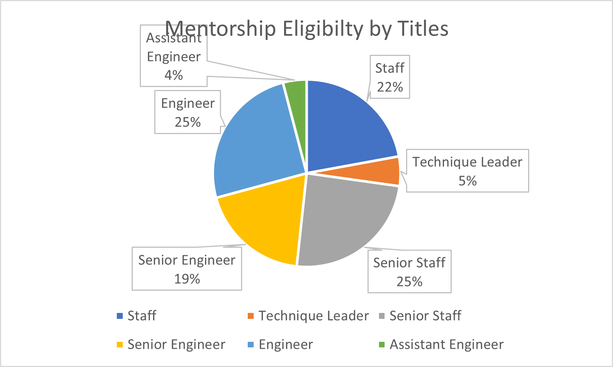

# Pewlett-Hackard-Analysis
## Overview of Project
The purpose of this report is to determine the number of retiring employees per title, and identify employees who are eligible to participate in a mentorship program.The report will include the number of retiring employees by titles, emplopyees eligibilty for the mentortship program. 
## Results
There are two major parts of the analysis, retiring employees by title and mentorship eligibility. 
- There are 90398 people will retire in this upcomming silver tsunami
- Among all people about to retire, largest group is senior enginners and senior staff, whoa take 1/3 of the total retiring titles. Followed by engineer and staff, which take around 15% of total retiring titles. 

- There are total of 1940 people are are eligible to the the mentorship program.
- Among totle people who eligible for the mentorship program, 1/4 are enginners and senior staff. 1/5 are senior engineer and staff. 

## Summary 
According to results, there were 90398 roles will need to be filled as the Silber Tsunami begins to make an impact. And only 2% of people who is qualified to mentor the next generation. If the ratio of mentor and mentee is 1:4, then, it is easier to fulfill the 10k retiring positions. 
